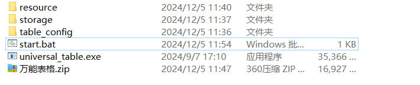
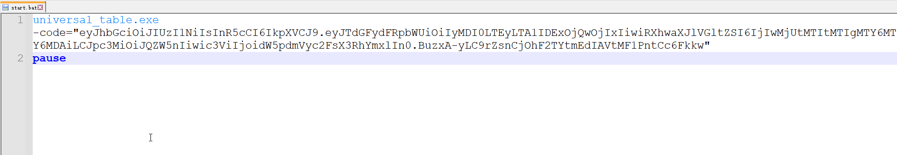
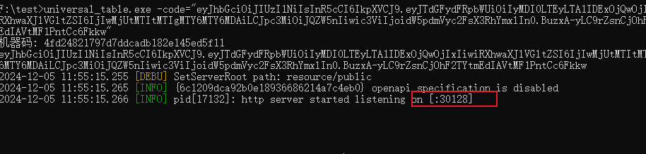
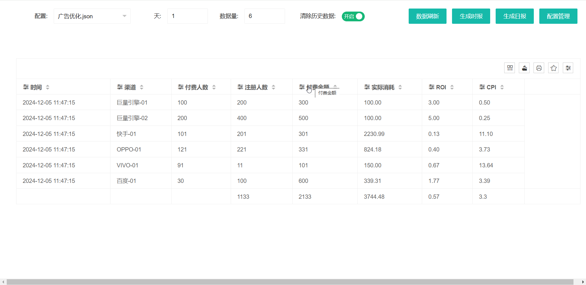

+++
date = '2024-12-05T14:00:00+08:00'
draft = true
title = '万能表格使用攻略'
tags = ['万能表格']
categories = ['技术分享']
keywords = ['万能表格']
image = "1.jpg"
+++

# 万能表格使用攻略
## 点击start.bat运行

## 运行后会生成机器码，发送给作者，作者会免费生成授权码

## 右键使用记事本打开start.bat, 复制授权码到-code里面

## 点击start.bat运行

## 浏览器访问 http://localhost:30128/

## 点击配置管理，已有的【广告优化.json】是测试数据，添加新的配置即可。

## 配置有疑问的可以联系作者免费咨询

## 安装包下载
1. [万能表格.zip](万能表格.zip)
2. [万能表格-mac-darwin-amd64.zip](万能表格-mac-darwin-amd64.zip)
3. [万能表格-linux-amd64.zip](万能表格-linux-amd64.zip)
4. [万能表格-linux-arm.zip](万能表格-linux-arm.zip)
5. [万能表格-mac-linux-arm.zip](万能表格-mac-linux-arm.zip)

## 自媒体
1. [小红书](http://xhslink.com/a/RtPIbt1Mo720)
